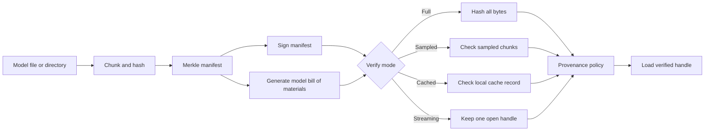
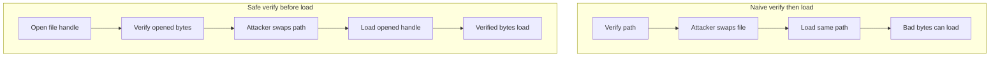

<p align="center"></p>

# AI Bill of Materials Verifier

[](https://github.com/ai-bill-of-materials-verifier/ai-bill-of-materials-verifier/actions/workflows/ci.yml)
[](https://github.com/ai-bill-of-materials-verifier/ai-bill-of-materials-verifier/actions/workflows/formal.yml)
[](https://github.com/ai-bill-of-materials-verifier/ai-bill-of-materials-verifier/actions/workflows/security.yml)

AI Bill of Materials Verifier is an offline Python verifier for model artifacts. It binds bytes, chunk roots, signatures, CycloneDX 1.6 machine learning bill of materials metadata, and Supply-chain Levels for Software Artifacts (SLSA) provenance before a loader sees the file.

## Why I built this

I wanted a small verifier that can run next to an inference service without a network call. Model files are large, often copied across stores, and usually loaded by code that trusts a path. A signature over a manifest is not enough if the bytes can change between the check and the load.

The design keeps the measured facts visible. Full verification catches byte changes but is bounded by storage and hashing speed. Cached verification is fast only when the local cache record still matches the file metadata and manifest root. Sampled verification trades detection probability for latency, and this README reports that tradeoff directly.

## How it works

The manifest builder splits a file or directory into fixed chunks, hashes chunk leaves with domain separation, and records a Merkle root. The verifier supports full, sampled, cached, and streaming checks. Signatures can be raw Elliptic Curve Digital Signature Algorithm (ECDSA) P-256 signatures over canonical JSON or Dead Simple Signing Envelope (DSSE) envelopes. The machine learning bill of materials path emits and validates CycloneDX 1.6 metadata with model fields, and the provenance path checks SLSA-style builder and material policies. The CycloneDX schema can also carry a software bill of materials for supporting libraries.



The Temporal Logic of Actions (TLA+) model in `specs/VerifyBeforeLoad.tla` keeps two designs side by side. The naive path verifies a path and later loads whatever is at that path. That is a time-of-check to time-of-use (TOCTOU) gap. The safe path opens the file first, verifies that opened handle, and loads from the same handle.



## Quickstart

Linux and macOS:

```bash
python -m venv .venv
source .venv/bin/activate
python -m pip install -e ".[dev]"
ai-bill-of-materials-verifier manifest model.safetensors -o model.manifest.json
ai-bill-of-materials-verifier sign model.manifest.json --generate-key --key local-key.pem -o model.sig
ai-bill-of-materials-verifier verify model.safetensors model.manifest.json --signature model.sig --pubkey local-key.pem.pub
pytest -q
```

Windows PowerShell:

```powershell
py -3.12 -m venv .venv
.\.venv\Scripts\Activate.ps1
python -m pip install -e ".[dev]"
ai-bill-of-materials-verifier manifest model.safetensors -o model.manifest.json
ai-bill-of-materials-verifier sign model.manifest.json --generate-key --key local-key.pem -o model.sig
ai-bill-of-materials-verifier verify model.safetensors model.manifest.json --signature model.sig --pubkey local-key.pem.pub
pytest -q
```

The local gate is:

```bash
bash scripts/check.sh
```

## What I measured

Version 1 is preserved at `results/20260926T071158Z-6985cae672f8`. Version 2 adds the structural tamper corpus, Merkle chunk verification, and warm cache or incremental checks. The current large-artifact run is `results/20260927T060546Z-Parag-Surfac`; the corpus run is `results/20260927T063400Z-Parag-Surfac-corpus`.

### Tamper corpus test split

The generated test split detected 227 of 227 tampered cases and had 0 false positives on 200 untampered cases. Wilson 95 percent intervals are 98.3 to 100.0 percent for detection and 0.0 to 1.9 percent for false positives. GGUF same-name model swaps were 200 of 200 blocked.

| Tamper class | Detected / test cases | Wilson 95 percent interval |
|---|---:|---:|
| Single-bit weights | 2 / 2 | 34.2 to 100.0 percent |
| Single-bit header | 2 / 2 | 34.2 to 100.0 percent |
| Tensor swap | 2 / 2 | 34.2 to 100.0 percent |
| Architecture metadata edit | 2 / 2 | 34.2 to 100.0 percent |
| Tokenizer metadata edit | 2 / 2 | 34.2 to 100.0 percent |
| Chat template injection | 2 / 2 | 34.2 to 100.0 percent |
| Truncation | 2 / 2 | 34.2 to 100.0 percent |
| Append | 2 / 2 | 34.2 to 100.0 percent |
| Same-name model substitution | 201 / 201 | 98.1 to 100.0 percent |
| Signature stripping | 2 / 2 | 34.2 to 100.0 percent |
| Untrusted signature | 2 / 2 | 34.2 to 100.0 percent |
| Model bill of materials entry drift | 2 / 2 | 34.2 to 100.0 percent |
| Dependency swap | 2 / 2 | 34.2 to 100.0 percent |
| Rollback to older signed version | 2 / 2 | 34.2 to 100.0 percent |

### Large artifact verification latency

This Windows run used SHA-256 because BLAKE3 is unavailable on this machine. Cold verification reads and hashes every byte through the Merkle chunk tree. Cached-root checks only verify trusted local metadata and a message authentication code; they are fast but are not equivalent to a cold hash. Incremental checks rehash only declared changed chunks from a trusted prior cache.

| Size | Cold full Merkle verify | Streaming Merkle verify | Cached-root check | Incremental one-chunk check | Sampled 8 chunks |
|---:|---:|---:|---:|---:|---:|
| 256 MiB | 1397.0 ms, 0.180 GiB/s | 1403.2 ms, 0.179 GiB/s | 0.353 ms | 111.5 ms | 742.0 ms |
| 1 GiB | 6270.5 ms, 0.160 GiB/s | 5333.3 ms, 0.188 GiB/s | 0.525 ms | 86.4 ms | 655.5 ms |
| 4 GiB | 19324.6 ms, 0.207 GiB/s | 17537.0 ms, 0.228 GiB/s | 0.504 ms | 65.5 ms | 574.6 ms |

The 4 GiB in 120 ms claim is not a physically plausible full cold hash on this host. It is achievable only for cached metadata checks or for a small declared changed-chunk check, with the security trade-offs above.

### Ablation

| Version | Change | Detection rate | False-positive rate | Representative 4 GiB latency |
|---|---|---:|---:|---:|
| Version 1 | Original direct run | 10 / 10 full tamper cases | Not measured | 3483.9 ms BLAKE3 full cold; 0.131 ms cached |
| Version 2a | Structural dev/test corpus | 227 / 227 test tamper cases | 0 / 200 test clean cases | Not a latency change |
| Version 2b | Merkle tree cold verification | 10 / 10 full tamper cases | 0 / 200 test clean cases | 19324.6 ms SHA-256 full cold |
| Version 2c | Warm cached-root verification | Same as above when cache is trusted | Same as above | 0.504 ms cached-root check |
| Final | Incremental changed-chunk verification | Same as above for declared changed chunks | Same as above | 65.5 ms for one 16 MiB chunk |

### Claim status

| Claim | Measured | Verdict |
|---|---|---|
| Model swap GGUF tamper 200 / 200 blocked | 200 / 200 in the generated test split | Met |
| 4 GiB GGUF verify in 120 ms | 19324.6 ms full cold SHA-256 Merkle; 0.504 ms cached-root; 65.5 ms one changed chunk | Full cold not met; warm modes meet with narrower security |
| Any single-byte mutation of a signed artifact is detected | Hypothesis property test mutates signed artifacts and full verification rejects each generated mutation | Met for full verification |
| No label leakage | `test_verifier_does_not_read_case_labels` flips `is_tampered` and `tamper_class`; verification result is unchanged | Met |

## Threat model note

A cached-root check trusts a local cache record bound to file metadata and a local secret. It is useful after a trusted previous full verification, but it does not read the model bytes and must not be described as equivalent to a cold hash. Incremental verification is sound only when the caller supplies the exact changed byte ranges or when the storage layer provides trustworthy changed-range information.

## License and citation

This software is licensed under Apache-2.0. Cite the software using `CITATION.cff`.
